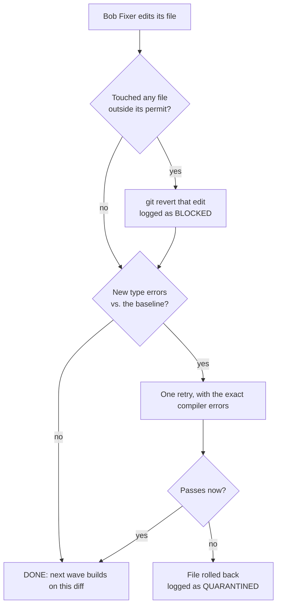
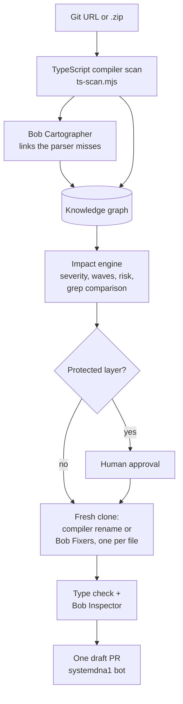

<div align="center">

# SystemDNA

### Find References for your whole system, and fix them all.

SystemDNA shows what a code change will break across your whole system.<br/>
Then a governed crew of **IBM Bob** agents fixes every affected file, checks the result and opens one draft pull request.

[](https://systemdna-ibm.dhairyashah.dev/)
[](#ibm-bob-is-the-engine)
[](https://systemdna-ibm.dhairyashah.dev/)


**[Live app](https://systemdna-ibm.dhairyashah.dev/)** · **[Demo video](#demo-video)** · **[How Bob is used](#ibm-bob-is-the-engine)** · **[Try it in 2 minutes](#try-it-in-2-minutes)** · **[Bob sessions](bob_sessions/)**

Built for the **IBM Bob 2.0 Hackathon** (lablab.ai, 25 to 27 September 2026)

</div>

---

## Demo video

<!--
  REPLACE VIDEO_URL below with the link to the demo video (YouTube, Vimeo, Loom...).
  For a clickable thumbnail, save a screenshot as docs/demo-thumbnail.png and swap the
  line below for:
  [](VIDEO_URL)
  
-->

**[▶ Watch the SystemDNA demo](VIDEO_URL)**


---

## The problem

Rename a database column, change a field's type or change a function's signature, and something breaks somewhere else. It might be an API route, a dashboard, a test, a doc or a migration.

The tools teams rely on each see only part of the picture:

- **Search tools like grep** miss uses that don't spell out the name, such as dynamic keys, and flag unrelated fields that happen to share it.
- **Type checkers** only check code. They say nothing about SQL, config, docs or migrations.
- **AI coding assistants** will edit anything, so nobody can prove the change is complete, or that it stayed in scope.

So teams either put off the change or ship it and find out in production what broke.

## The solution

| | Step | What SystemDNA does |
| --- | --- | --- |
| 1 | **Map** | Scans a repo into a knowledge graph of every component: tables, columns, types, fields, functions, API routes, components, pages, tests, docs and business use. Links come from the TypeScript compiler's "find all references", so two fields with the same name are never confused. |
| 2 | **Predict** | Pick a change: rename, change type, change signature, delete, or describe it in plain English. See the ripple: what breaks, how badly, in what order, and which business process is hit, with a risk score from 0 to 100. |
| 3 | **Fix** | IBM Bob Fixer agents edit every affected file wave by wave, in dependency order. Each agent has a permit for exactly one file. |
| 4 | **Govern** | Protected layers wait for a human to approve. Agents that go out of scope are blocked, and edits that don't type-check are rolled back. Every step is watched live in **Agent City**. |
| 5 | **Prove** | Type check, then an IBM Bob Inspector review, then **one draft pull request** built from exactly the diff you previewed, with the impact report and an audit trail. |

---

## IBM Bob is the engine

**IBM Bob is the only AI in SystemDNA.** The TypeScript compiler maps the system. Bob does every job that needs judgement. SystemDNA checks every edit Bob makes before a person sees it.

Bob Shell runs headless on the server (`bob run --format json`, with `--max-cost`, `--max-turns` and a timeout). Each agent is its own Bob process.

| Agent | When it runs | What Bob does | Code |
| --- | --- | --- | --- |
| **Bob Fixer** | Every change a compiler can't make: type changes, signature changes, deletes, database renames, plain-English changes | One agent per affected file, wave by wave. Each gets the change in plain words, the graph evidence for why its file breaks, the diff of earlier waves, and a permit for its own file. For a database change, the Fixer on the schema file writes a **new migration** in the repo's own naming style. | [change-agent.ts](systemdna/web/lib/server/change-agent.ts) |
| **Bob Inspector** | After every real run and every pull request preview | Reviews the whole diff against the plan for what a compiler can't see: string keys, dynamic property access, JSON, SQL, tests and docs. Returns a verdict, a summary and issues with line numbers, which go into the run trace and the PR description. | [github-agent.ts](systemdna/web/lib/server/github-agent.ts) |
| **Bob Cartographer** | When a repo is connected with **Enrich with IBM Bob** | Finds the links a parser misses (`fetch()` calls to API routes, string keys, config, environment variables, docs) and flags fields that hold personal data. Its links show as *Found by Bob*. | [bob-cartographer.ts](systemdna/web/lib/server/bob-cartographer.ts) |

### Governed Bob: every edit is checked, not trusted



- **Permits are enforced with git, not just the prompt.** Any edit outside the agent's file is reverted and shown as *Blocked*.
- **Only new errors count.** Each edit is type-checked against a baseline taken before any change, so errors that already existed in the repo don't fail an agent.
- **Budgets.** Each Fixer is capped at 1.5 Bobcoins and a whole run at 5 (`BOB_RUN_MAX_COST`). When the budget runs out, the run stops cleanly and keeps what it has done.
- **The Inspector only reads.** Anything it edits is thrown away, so the PR is exactly the diff the user previewed.
- **Parser links win.** A Cartographer link is kept only when the parser already found both ends.
- **Human approval** is required for protected layers (database, types).
- **The key never leaves the server.** `BOB_API_KEY` is passed only to the Bob process environment and scrubbed from every message. See for yourself: [`/api/bob/status`](https://systemdna-ibm.dhairyashah.dev/api/bob/status) shows the live server's Bob status and never the key.

### Bob built SystemDNA with us

We used **Bob IDE** throughout the hackathon. The exported sessions are in [`bob_sessions/`](bob_sessions/). In them, Bob:

- audited the whole codebase, listed what was built and what was missing, and drew the architecture for the knowledge graph and GitHub agent
- wrote the first version of the real change-run path (`/api/changes/run`, the streaming client in `lib/api.ts`, and the real-versus-simulated switch in `run-client.tsx`), then ran `tsc` and ESLint and reported what it had and had not verified
- audited how we handle the Bob key, and wrote our AWS deployment plan
- rewrote the README and resolved merge conflicts between our branches

Bob IDE wrote the first version of the run path that the Bob Fixers now use in the product.

---

## Proof it works

| | |
| --- | --- |
| **Live on AWS** | [systemdna-ibm.dhairyashah.dev](https://systemdna-ibm.dhairyashah.dev/), with Bob Shell 2.0.5 running on the server and GitHub App sign-in |
| **Real pull requests** | Draft PRs opened by the `systemdna1[bot]` GitHub App on [marketplace-dashboard](https://github.com/krishil-agrawal-itp/marketplace-dashboard/pulls), each with its impact report, agents table, audit log and Bob Inspector verdict. On one, the Inspector *requested changes*: it doesn't just approve everything |
| **Compiler-accurate graph** | `marketplace-dashboard`: 31 code files, 202 nodes and 643 links in about 4 seconds |
| **Beats grep** | Renaming `Deployment.successRate` touches 6 files in 2 waves. Grep would also flag 2 files that use a *different* `successRate` |
| **Fast** | Impact analysis averages 0.33 ms on the demo graph and stays under 1 second on a 6,000-node, 30,000-link graph (`npm run bench`) |
| **Tested** | 21 impact engine tests, covering severity rules, the alias stop, cycles, risk scoring, personal-data detection and a speed budget (`npm test`) |
| **Never runs your code** | The scanner and agents only parse and type-check. Nothing from a scanned repo is installed, built or executed |

---

## Try it in 2 minutes

On the **[live app](https://systemdna-ibm.dhairyashah.dev/)** (or `localhost` after the [quick start](#run-it-locally)):

1. The **`marketplace-dashboard`** demo repo is loaded. Pick it in the repository switch in the top bar.
2. Open **Agent City** and explore the graph as a dependency map, a 3D city (one building per file) or a force graph.
3. Go to **New change**. Pick `Deployment.successRate`, rename it to `deploySuccessRate`, then **Analyse impact**. You get 6 files in 2 waves, and the grep comparison flags 2 false alarms.
4. **Approve plan and run.** `lib/types.ts` is protected, so the run waits for your **Approve**. Then it runs for real in a fresh clone: compiler rename, type check, then the Bob Inspector review (about 2 minutes).
5. Now a change no compiler can make: **Change type** of `Deployment.successRate` to `number | null`. Watch Bob Fixer agents walk the city map, file by file, wave by wave (about 7 minutes, about 1 Bobcoin).
6. The **Pull request** panel shows the diff and Bob's verdict. **Open draft pull request** pushes exactly that diff to a new `systemdna/...` branch.

To analyse your own code: **Repositories → Connect repository**, then paste a public Git URL or upload a `.zip` (up to 50 MB). Tick **Enrich with IBM Bob** to run the Cartographer.

---

## How it fits together



| Change kind | Applies to | Who fixes it |
| --- | --- | --- |
| Rename | Fields, columns, tables, types, functions, constants, components | TypeScript compiler for TS symbols; Bob Fixers for tables and columns (schema, migration, SQL, code) |
| Change type | Fields, columns, constants | Bob Fixers |
| Signature | Functions | Bob Fixers |
| Delete | Anything | Bob Fixers |
| Describe | Anything, in plain English | Bob Fixers decide what really needs an edit |

**Built with:** IBM Bob Shell and Bob IDE · Next.js 16 · React 19 · TypeScript compiler API · Three.js · Cytoscape · D3 force · Tailwind CSS 4 · zustand · GitHub App API · AWS

---


## Run it locally

**You need** Node.js 20 or later (tested on 22), npm, and `git` on your `PATH`.

```bash
# 1. Install the scanner and the web app
cd systemdna/core/scanner && npm install
cd ../../web && npm install

# 2. Optional: configure Bob and GitHub
cp .env.example .env.local

# 3. Run
npm run dev          # http://localhost:3000
```

The app works with no settings. These turn on the rest:

| Variable | Turns on |
| --- | --- |
| `BOB_API_KEY` (+ `BOB_CLI` if `bob` isn't on your `PATH`) | All three Bob agents |
| `GITHUB_APP_ID`, `GITHUB_APP_SLUG`, `GITHUB_APP_PRIVATE_KEY_PATH` | Draft PRs through a GitHub App (preferred) |
| `GITHUB_TOKEN` | Draft PRs through a fine-grained token (Contents and Pull requests: read and write) |
| `BOB_TIMEOUT_MS`, `BOB_MAX_COST`, `BOB_MAX_TURNS`, `BOB_RUN_MAX_COST` | Bob limits (defaults: 240000 ms, 3, 20, 5) |

**Install IBM Bob Shell** (needs Node.js 22 or later):

```bash
# macOS and Linux
curl -fsSL https://bob.ibm.com/download/bobshell.sh | bash
```

```powershell
# Windows
powershell -c "irm -Uri https://bob.ibm.com/download/bobshell.ps1 | iex"
```

Check it with `bob --version` and restart `npm run dev`. **Settings** in the app shows when Bob is ready. Without Bob, everything else still works, and the Bob steps show "skipped" with the reason.

**Checks**, from `systemdna/web`: `npm test` (impact engine), `npm run bench`, `npm run lint`, `node node_modules/typescript/bin/tsc --noEmit`.

### Command-line tools

The scanner and the rename agent also run on their own, from `systemdna/core/scanner`:

```bash
node ts-scan.mjs <repo-dir> <out.json> [--progress] [--max-files 2500]          # build graph.json
node ts-rename.mjs <repo-dir> --field Type.field --to newName [--apply]          # compiler rename; refuses if it adds type errors
node ts-check.mjs <repo-dir> --files a.ts,b.tsx                                  # type errors in some files
```

---

## Repository map

```text
systemdna/
├── core/scanner/   ts-scan.mjs (graph), ts-rename.mjs (compiler rename), ts-check.mjs (type check)
├── web/            Next.js app: Agent City UI and every server API
│   ├── app/(app)/    overview, repos, city, changes, governance, settings
│   ├── app/api/      repos, changes/run, changes/pull-request, github, bob/status
│   └── lib/server/   bob.ts, change-agent.ts, github-agent.ts, bob-cartographer.ts, ingest.ts
└── engine/         Python backend (in progress): LangGraph, Neo4j, MCP server, Bob hooks
.bob/               Bob IDE custom mode, propagate-rename Skill, hooks
bob_sessions/       Exported IBM Bob sessions
```

<details>
<summary><b>API reference</b></summary>

| Method and path | Does |
| --- | --- |
| `GET /api/repos` | List connected repos |
| `POST /api/repos` | Connect a repo: JSON `{ url, ref?, bob? }` or a multipart form with `file`. Streams progress (NDJSON) |
| `GET /api/repos/{id}` | The repo's graph |
| `POST /api/repos/{id}/rescan` | Pull the latest code and rebuild the graph |
| `DELETE /api/repos/{id}` | Remove the repo and its graph |
| `POST /api/changes/run` | Run a planned change in a fresh clone. Streams run events, the Bob review and the diff. Nothing is pushed |
| `POST /api/changes/pull-request` | `{ patchId, title, body }`: open a draft PR from a run's stored diff |
| `POST /api/github/pull-requests` | Preview a rename (`dryRun: true`, with the Bob review) or open a draft PR. Streams progress |
| `GET /api/github/status` | GitHub App or token status (never returns a secret) |
| `GET /api/github/install/callback` | GitHub App install callback |
| `GET /api/bob/status` | Whether IBM Bob is ready: key set, CLI found, version (never returns the key) |

More in the [web app README](systemdna/web/README.md).

</details>

---

## Security

- The Bob API key, GitHub token and GitHub App key stay on the server. They never appear in a URL, argument, file, log or error message.
- PRs are always drafts, always on a new `systemdna/...` branch, and open only after the user confirms. The default branch is never touched.
- Git runs without a shell, with timeouts and no prompts. Branch names are checked against option injection.
- Uploaded zips that try to write outside their folder are refused, and so are file paths that escape the repo.
- `.env` and `.env.local` are git-ignored. Read [SECURITY.MD](SECURITY.MD) before every commit.

## What's next

- **Bob IDE as the front door:** the `systemdna-planner` custom mode and `propagate-rename` Skill in [`.bob/`](.bob/), driving SystemDNA through an MCP server
- **Hooks as a second guard:** a Bob `PreToolUse` hook that refuses out-of-permit writes before they happen
- **More languages:** Python, SQL column lineage and PySpark, with the same graph format
- **CI guard:** a GitHub check that posts the impact of every pull request
- **Webhooks:** re-scan on every push

## Team

<!-- Add team member names, roles and links here. -->

## Documentation

- [PRD](<SystemDNA — PRD (IBM Bob 2.0 Hackathon).md>): the full product spec
- [STATUS.md](systemdna/STATUS.md): build status and roadmap
- [TEAM_PLAN.md](TEAM_PLAN.md): roles and feature ownership
- [Web app README](systemdna/web/README.md): pages, data modes, type contracts
- [Scanner README](systemdna/core/scanner/README.md): how the graph is built
