# SystemDNA — EC2 Deployment Flowchart

> Every node in this diagram maps to a real step in `DEPLOYMENT.md`.
> Colour key: 🔵 your laptop · 🟠 AWS Console/CLI · 🟢 EC2 host · 🟣 containers

```mermaid
flowchart TD

    %% ─────────────────────────────────────────────
    %% PHASE 0 — LAPTOP PREP
    %% ─────────────────────────────────────────────
    subgraph P0["🔵 Phase 0 — Your Laptop (30 min)"]
        direction TB
        L1["Check tools:\naws, docker, docker compose,\ngit, ssh, node"]
        L2["Gather secrets:\nGEMINI_API_KEY\nGITHUB_TOKEN\nDEMO_TOKEN\nAWS creds\nEC2 key pair .pem"]
        L3["Create systemdna/engine/.env\nfrom .env.example\n(never commit this)"]
        L4{"Is .env\nin .gitignore?"}
        L5["✅ Safe to continue"]
        L6["🚨 Add to .gitignore NOW\nbefore any git push"]
        L1 --> L2 --> L3 --> L4
        L4 -- "Yes" --> L5
        L4 -- "No" --> L6
    end

    %% ─────────────────────────────────────────────
    %% PHASE 1 — AWS NETWORK (runs in parallel)
    %% ─────────────────────────────────────────────
    subgraph P1["🟠 Phase 1 — AWS Network (CP1, hours 1–10)"]
        direction TB
        A1["Create AWS Budgets alert\n⚠️ DO THIS FIRST\n(alert at $20)"]
        A2["Create VPC:\n2 public subnets + 1 private subnet"]
        A3["Launch EC2 t3.xlarge\nUbuntu 22.04\n50 GB gp3 EBS\nPrivate subnet\nIAM role (no access keys)"]
        A4["Create S3 buckets:\n• systemdna-dashboard\n• systemdna-artifacts (versioning ON)"]
        A5["Create DynamoDB table:\nsystemdna-events\nkey: change_id · sort: ts"]
        A6["Store secrets in\nSecrets Manager:\nsystemdna/gemini\nsystemdna/github\nsystemdna/demo"]
        A7["Create ALB + ACM cert\nPath rules:\n/api/* → EC2:8080\n/ws → EC2:8080\n/mcp/* → EC2:3000\n/events → EC2:8080\n/* → CloudFront"]
        A8["⚠️ Set ALB idle timeout\nto 3600s\n(default 60s drops WebSocket)"]
        A9["Create CloudFront\ndistribution\n→ S3 dashboard bucket"]
        A10["Create ECR repository:\nsystemdna-engine"]
        A1 --> A2 --> A3
        A2 --> A4
        A2 --> A5
        A2 --> A6
        A2 --> A7 --> A8
        A7 --> A9
        A2 --> A10
    end

    %% ─────────────────────────────────────────────
    %% PHASE 2 — EC2 BOOTSTRAP
    %% ─────────────────────────────────────────────
    subgraph P2["🟢 Phase 2 — EC2 Bootstrap"]
        direction TB
        B1["SSH into EC2:\nssh -i key.pem ubuntu@EC2-IP"]
        B2["Run deploy/bootstrap.sh\n(already exists in repo)\n• apt-get install docker.io\n• systemctl start docker\n• curl install Bob Shell\n• git clone repo to /app"]
        B3{"bob -p test\nwithout a person:\ndoes it work?"}
        B4["✅ Bob Shell works\nParallel workers OK"]
        B5["⚠️ Fallback mode:\nAG2 Fixer agents replace\nbob -p workers\n(already supported in orchestrator.py)"]
        B1 --> B2 --> B3
        B3 -- "Yes" --> B4
        B3 -- "No" --> B5
    end

    %% ─────────────────────────────────────────────
    %% PHASE 3 — SECRETS TO EC2
    %% ─────────────────────────────────────────────
    subgraph P3["🔵 Phase 3 — Copy Secrets (your laptop)"]
        C1["scp .env to EC2:\nscp -i key.pem\nsystemdna/engine/.env\nubuntu@EC2-IP:/app/systemdna/engine/.env"]
        C2["Verify on EC2:\nhead -3 /app/systemdna/engine/.env"]
    end

    %% ─────────────────────────────────────────────
    %% PHASE 4 — START CONTAINERS
    %% ─────────────────────────────────────────────
    subgraph P4["🟣 Phase 4 — Start 6 Docker Containers (EC2)"]
        direction TB
        D1["cd /app/systemdna/engine\ndocker compose up -d --build"]
        D2["Watch startup:\ndocker compose logs -f --tail=50\n(neo4j takes ~30s)"]
        D3["docker compose ps\n→ verify all healthy"]

        subgraph CONTAINERS["Running containers"]
            direction LR
            DC1["neo4j:5\n:7474 :7687\nknowledge graph"]
            DC2["chromadb\n:8000\nvector store"]
            DC3["redis:7-alpine\n:6379\nLangGraph checkpoints"]
            DC4["engine\ninternal\nscanners + agents"]
            DC5["api\n:8080\nFastAPI REST + WS"]
            DC6["mcp\n:3000\nFastMCP for Bob IDE"]
        end

        D1 --> D2 --> D3 --> CONTAINERS
    end

    %% ─────────────────────────────────────────────
    %% PHASE 5 — SHOPFLOW SETUP
    %% ─────────────────────────────────────────────
    subgraph P5["🟢 Phase 5 — Set Up ShopFlow on EC2"]
        E1{"Real ShopFlow\nbuilt by FDE2?"}
        E2["git clone shopflow\nto /workspace/shopflow"]
        E3["Copy test fixtures:\ncp tests/fixtures/shopflow\n/workspace/shopflow"]
        E1 -- "Yes" --> E2
        E1 -- "No (use fixtures)" --> E3
    end

    %% ─────────────────────────────────────────────
    %% PHASE 6 — SMOKE TESTS
    %% ─────────────────────────────────────────────
    subgraph P6["✅ Phase 6 — Smoke Tests"]
        direction TB
        F1["curl /health\n→ {status: ok}"]
        F2["curl /graph\n→ valid JSON\n(nodes: 0 until scanners built)"]
        F3["POST /changes\n→ change_id + report\n(target: < 1 second)"]
        F4["wscat ws://localhost:8080/ws\n→ connects, stays open"]
        F5["permit_check.py test:\nout-of-permit edit\n→ exit code 2 (BLOCKED)"]
        F6{"All 5 tests\npassed?"}
        F7["✅ Engine is live\nConnect frontend"]
        F8["❌ Fix the failing test\nCheck docker compose logs"]
        F1 --> F2 --> F3 --> F4 --> F5 --> F6
        F6 -- "Yes" --> F7
        F6 -- "No" --> F8
        F8 --> F1
    end

    %% ─────────────────────────────────────────────
    %% PHASE 7 — FRONTEND DEPLOY
    %% ─────────────────────────────────────────────
    subgraph P7["🔵 Phase 7 — Deploy Frontend (your laptop)"]
        G1["Set NEXT_PUBLIC_API_URL\nin systemdna/web/.env.local\n→ https://your-alb-domain.com"]
        G2["npm install && npm run build\nOutput: out/"]
        G3["aws s3 sync out/\ns3://systemdna-dashboard/ --delete"]
        G4["aws cloudfront\ncreate-invalidation\n--paths '/*'"]
        G5["Open browser:\nhttps://your-cloudfront-domain\nAgent City map must show\nreal nodes (not simulator)"]
        G1 --> G2 --> G3 --> G4 --> G5
    end

    %% ─────────────────────────────────────────────
    %% PHASE 8 — CI/CD
    %% ─────────────────────────────────────────────
    subgraph P8["🟠 Phase 8 — CI/CD (CP1, hours 10–14)"]
        H1["GitHub Actions secret scan\n(gitleaks) — BUILD FIRST\n⚠️ IBM disables accounts that leak keys"]
        H2["GitHub Actions: test + build\ndocker build\naws ecr push\nssh EC2 → docker compose up"]
        H3["Use existing deploy.sh:\nsystemdna/engine/deploy/deploy.sh"]
        H4["Add to root Makefile:\nmake deploy\nmake teardown"]
        H1 --> H2 --> H3 --> H4
    end

    %% ─────────────────────────────────────────────
    %% DEMO VERIFICATION
    %% ─────────────────────────────────────────────
    subgraph DEMO["🎬 Pre-Demo Checklist"]
        direction TB
        V1["All 6 containers healthy"]
        V2["GET /graph → nodes ≥ 30"]
        V3["POST /changes → 17 affected nodes\nin < 1 second"]
        V4["WebSocket → events stream live\nto Agent City map"]
        V5["Out-of-permit edit\n→ BLOCKED (exit 2)\n→ red stop sign on map"]
        V6["After all waves:\nGET /diff → after: 0\n'Dangling references: 0'"]
        V7["GitHub PR created\nwith impact report"]
        V8["Record clean run NOW\n(replay fallback for demo)"]
        V1 --> V2 --> V3 --> V4 --> V5 --> V6 --> V7 --> V8
    end

    %% ─────────────────────────────────────────────
    %% TEARDOWN
    %% ─────────────────────────────────────────────
    TEARDOWN["🧹 After Judging:\nmake teardown\ncdk destroy --all\nVerify: no EC2, no S3, no DynamoDB\n(avoid surprise bills)"]

    %% ─────────────────────────────────────────────
    %% FLOW BETWEEN PHASES
    %% ─────────────────────────────────────────────
    L5 --> P1
    L5 --> P2
    P2 --> P3
    P3 --> P4
    P4 --> P5
    P5 --> P6
    P1 --> P6
    P6 --> P7
    P6 --> P8
    P7 --> DEMO
    P8 --> DEMO
    DEMO --> TEARDOWN

    %% ─────────────────────────────────────────────
    %% PARALLEL TRACK NOTE
    %% ─────────────────────────────────────────────
    subgraph BUILD["🔧 Build Track (runs in parallel with infra)"]
        direction LR
        BB1["FDE1: Python + SQL scanners\n→ graph is empty without these"]
        BB2["FDE2: ShopFlow + orchestrator\n→ agent waves need this"]
        BB3["FDE3: Bob modes + hooks\n→ governance enforcement"]
        BB4["FDE4: Frontend panels\n→ live data display"]
        BB1 --> BB2 --> BB3 --> BB4
    end

    P0 -.->|"Build track starts\nimmediately at hour 0"| BUILD
    BUILD -.->|"scanners ready\n→ graph has nodes"| P6

    %% Styles
    style P0 fill:#dbeafe,stroke:#3b82f6
    style P1 fill:#fef3c7,stroke:#f59e0b
    style P2 fill:#dcfce7,stroke:#22c55e
    style P3 fill:#dbeafe,stroke:#3b82f6
    style P4 fill:#f3e8ff,stroke:#a855f7
    style P5 fill:#dcfce7,stroke:#22c55e
    style P6 fill:#dcfce7,stroke:#16a34a
    style P7 fill:#dbeafe,stroke:#3b82f6
    style P8 fill:#fef3c7,stroke:#f59e0b
    style DEMO fill:#fdf4ff,stroke:#7c3aed
    style TEARDOWN fill:#fee2e2,stroke:#ef4444
    style BUILD fill:#f0fdf4,stroke:#15803d
    style CONTAINERS fill:#f5f3ff,stroke:#8b5cf6
```



---

## Phases at a Glance

| Phase | Who | When | What |
|---|---|---|---|
| 0 — Laptop prep | Everyone | Hour 0 | Tools, secrets, `.env` |
| 1 — AWS network | CP1 | Hours 1–10 | VPC, ALB, S3, DynamoDB, CloudFront, Budgets |
| 2 — Bootstrap EC2 | CP2 | Hours 0–3 | Docker, Bob Shell, repo clone — **risk test** |
| 3 — Copy secrets | CP2 | Hour 3 | `.env` → EC2, Secrets Manager |
| 4 — Start containers | CP2 | Hours 3–8 | `docker compose up` — 6 containers live |
| 5 — ShopFlow setup | FDE2 | Hours 0–3 | ShopFlow repo or test fixtures |
| 6 — Smoke tests | All | Hour 8 | API, WebSocket, permit hook, graph |
| 7 — Frontend deploy | CP1 | Hour 6+ | S3 + CloudFront, `NEXT_PUBLIC_API_URL` |
| 8 — CI/CD | CP1 | Hours 10–14 | GitHub Actions, `make deploy`, `make teardown` |
| Build track | FDE1–3 | Hours 0–20 | Scanners, orchestrator, Bob modes |
| Demo verify | All | Hour 20 | Full end-to-end, record clean run |
| Teardown | CP1 | After judging | Remove all AWS resources |

## Critical Path (the 3 things that block everything else)

```
Hour 0–3:   Bob Shell works on EC2 without a person? → Confirm or switch to AG2 fallback
Hour 6:     Dashboard reachable at public HTTPS URL?  → If no, demo from laptop
Hour 8:     graph.json has all 7 layers?              → If no, drop tree-sitter, regex only
```
